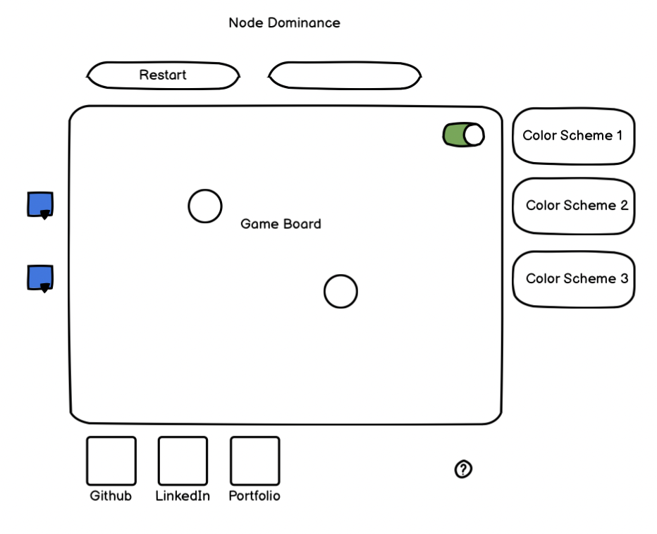

## Background

Node Dominance is an interactive game project.  It is based off the game Sprouts created by John Horton Conway and Micheal S. Paterson in the 1960s. The original game is played with paper and pencil. When you open the app you will have a new game generated with a default of two nodes.

This game will allow variations in gameplay by allowing the players to increase the starting nodes.

## Rules of the game

The game is played with two players with at least two starting nodes.  The two players take turns by connecting two nodes with an unbroken line.  This line may not intersect other lines or nodes before reaching the target node.  Following a legal move, a new node is created along the newly created line.  Each node may have a maximum of 3 connections.  The player left without a legal move is the loser.

## Functionality & MVPs

With Node Dominance, users will be able to:

- Reset the game board
- Draw a custom path to connect nodes
- Choose from preset initial states
- Select player color

Also included:
- Help icon describing rules of the game
- Sound with Toggle button
- A production README

## Wireframes

