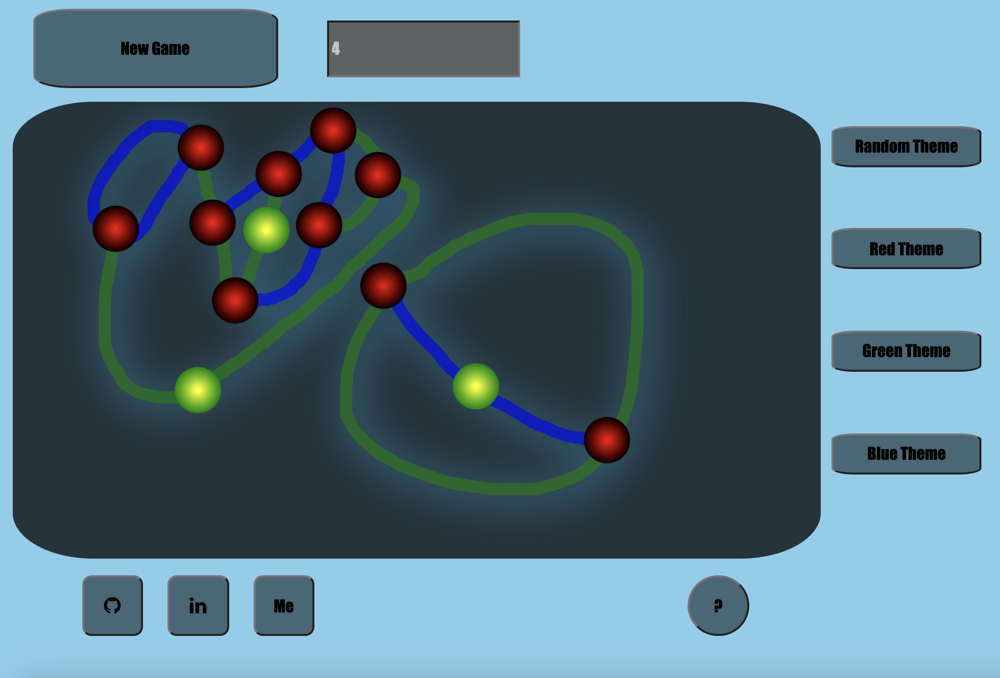

# Node Dominance
[live site](https://ecopool.herokuapp.com/)

## Background

Node Dominance is an interactive game project.  It is based off the game Sprouts created by John Horton Conway and Micheal S. Paterson in the 1960s. The original game is played with paper and pencil. When you open the app you will have a new game generated with a default of two nodes.

This game will allow variations in gameplay by allowing the players to increase the starting nodes.

## Rules of the game

The game is played with two players with at least two starting nodes.  The two players take turns by connecting two nodes with an unbroken line.  This line may not intersect other lines or nodes before reaching the target node.  Following a legal move, a new node is created along the newly created line.  Each node may have a maximum of 3 connections.  The player left without a legal move is the loser.

## Functionality & MVPs

With Node Dominance, users will be able to:

- Reset the game board
- Draw a custom path to connect nodes
- Choose from preset initial states
- Select player color

Also included:
- Help icon describing rules of the game
- Sound with Toggle button
- A production README

## Wireframes

- Navigation links to my Github repo, LinkedIn, Portfolio
- On the left, there will be selectable colors for each player
- On the right, there will be different themes to select
- In the upper right will be and option to remove sound
- There will be a help icon in the lower right
- There will be a reset game button and an option to add starting nodes

## Game Play

## Technologies, Libraries, APIs

This project will be implemented with the following technologies:
- Canvas to render the game board
- Webpack
- Paper.js to work with vectors

## Implementation Timeline
- Friday Afternoon & Weekend: Setup project; getting webpack up and running, have canvas render to screen.  Create Board, Player, Node classes.  Render intial state of board in canvas.

- Monday:  Dedicate this day to the underlying logic of Node Dominance.  

- Tuesday: Get the game to correctly render to canvas.  Then focus on rendering lines and additional nodes.

- Wednesday: Finish implementing controls, and focus on styling and ensuring all links work.

- Thursday Morning: Deploy game and rewrite proposal as production.

## Code Snippet

- This is the primary logic used to determine legal moves.  

## Bonus feature
- Add a number to each node representing the number available branches from node
- Add additional randomly populated nodes
- Add motion effects to line while drawing
- Highlight available moves
- Highlight legal moves from a specific node
- Explore variations and multiplayer from separate computers.
